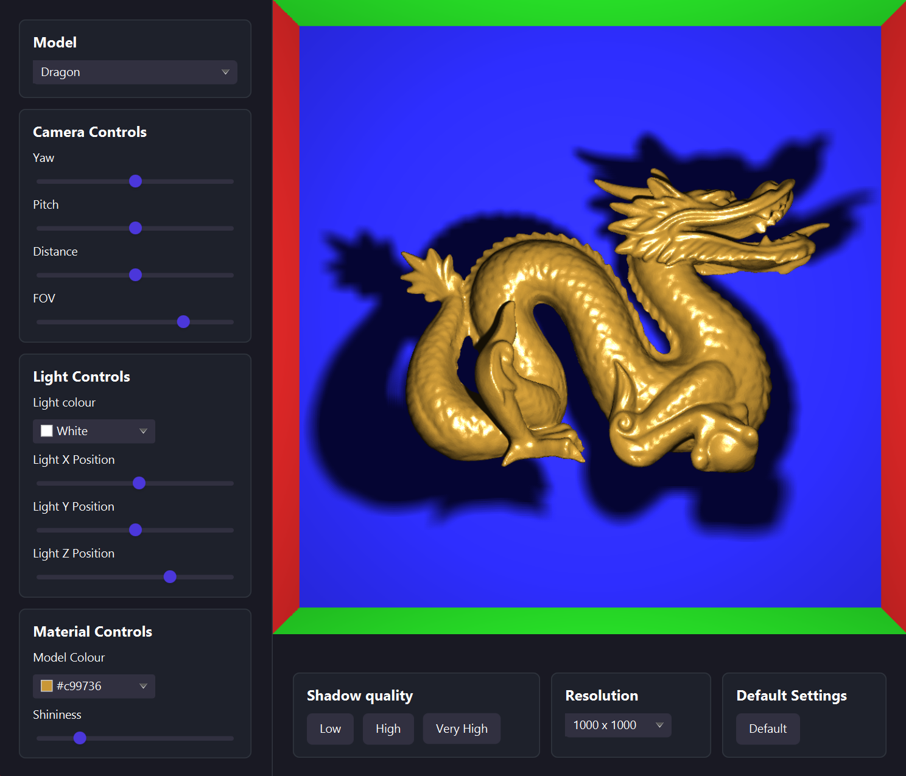
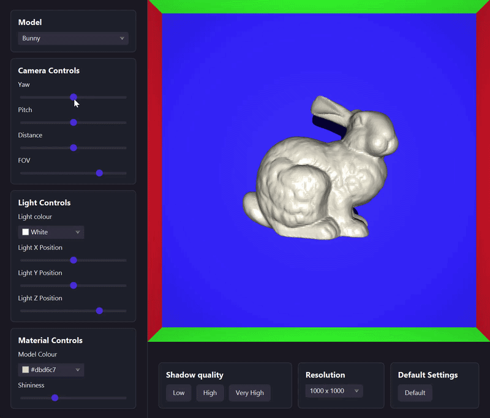
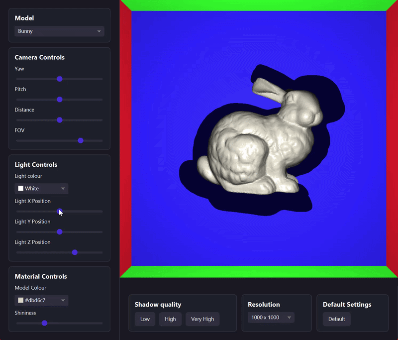
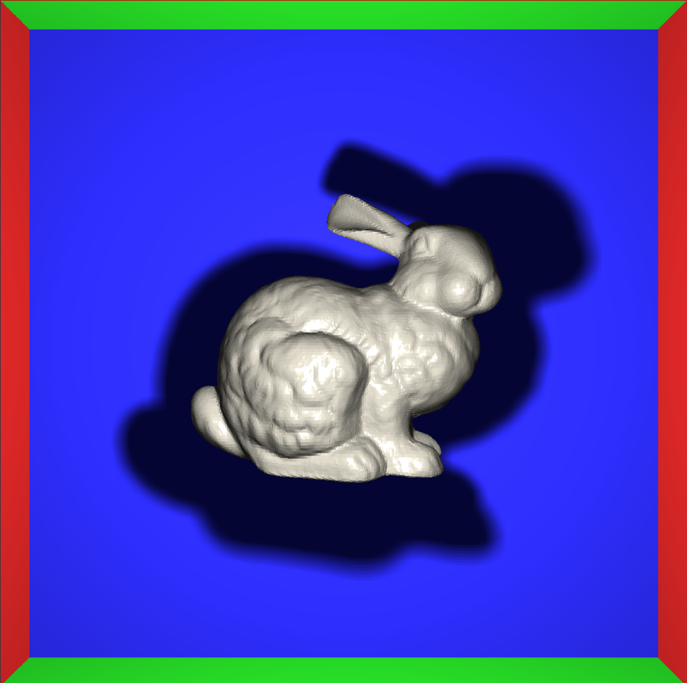
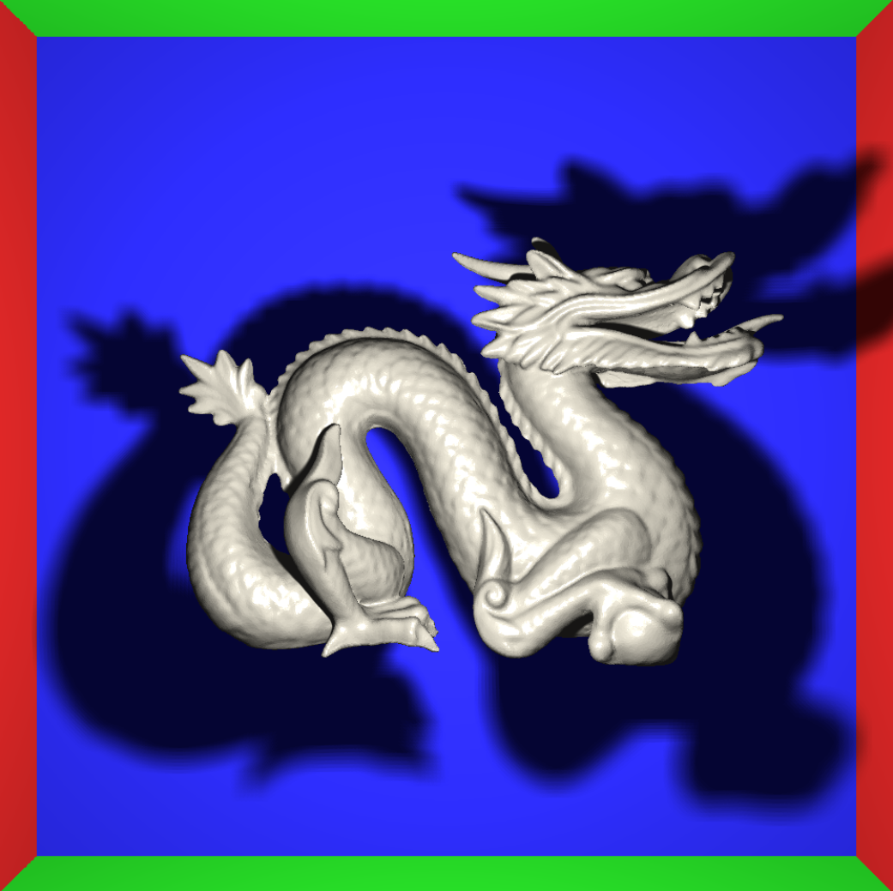
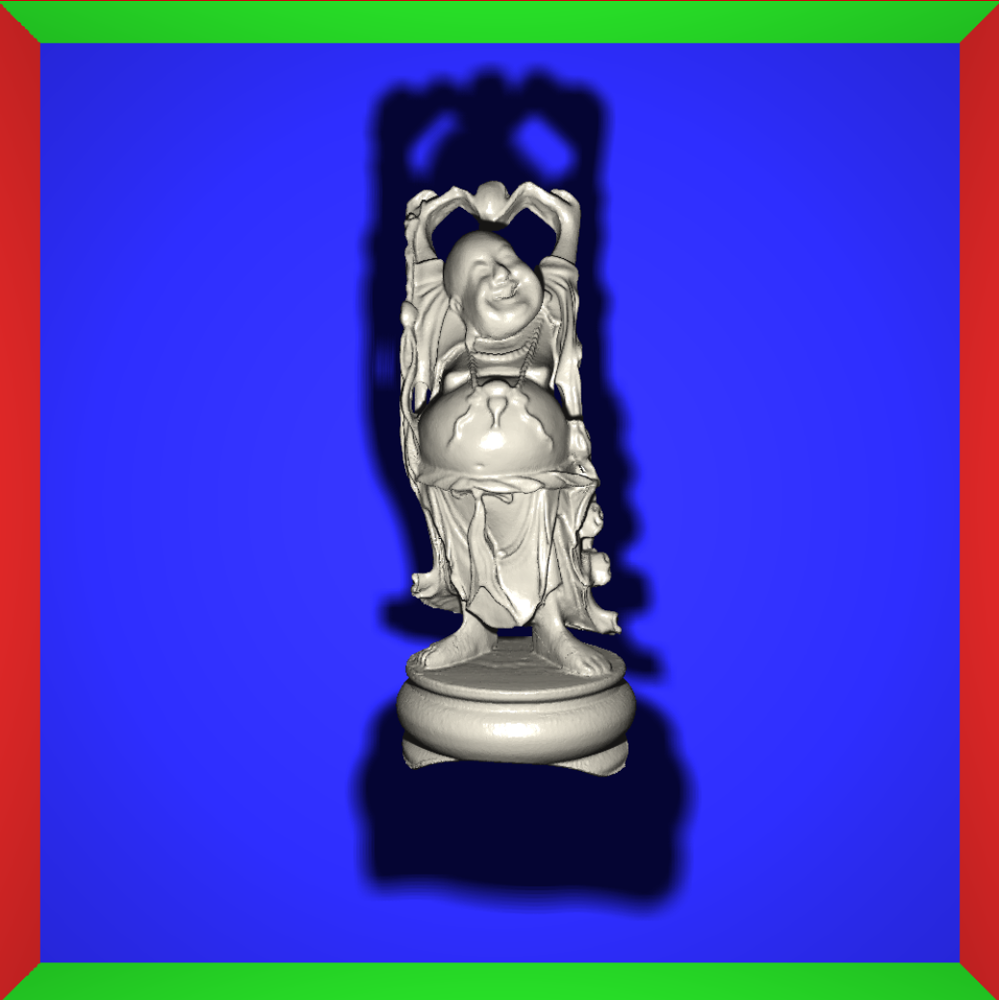

<a id="readme-top"></a>

# Java Ray Tracer

An interactive ray tracer written in Java and JavaFX, supporting triangle meshes, soft shadows, interactive camera controls, and BVH acceleration.



## About

This is a CPU-based ray tracer built from scratch as part of my final year dissertation.

Images are generated by casting rays from a virtual camera into a 3D scene, finding object intersections, and calculating lighting and shadows.

The renderer can load and render complex PLY triangle meshes containing over **1 million triangles**.

A JavaFX interface lets you control the camera, lighting, material properties, and render quality interactively.

## Features

- Renders complex PLY triangle meshes
- Interactive 3D camera
  - Yaw
  - Pitch
  - Distance
  - Field of view
- Soft shadows with configurable sample quality
- Bounding Volume Hierarchy (BVH) acceleration
- Adjustable model colour and shininess
- Adjustable light colour and position
- Configurable render resolution
- Multithreaded rendering

## UI

### Camera Controls



### Lighting Controls



## Running the application

### Requirements

- Java 21

The Maven wrapper is included therefore a separate Maven installation is not required.

From the project directory:

**Windows**

```powershell
.\mvnw.cmd clean javafx:run
```

**macOS / Linux**

```bash
./mvnw clean javafx:run
```

## Project Structure

```text
src/
├── main/
│   ├── java/
│   │   └── com/example/raytracer/
│   │       ├── render/
│   │       ├── scene/
│   │       ├── geometry/
│   │       ├── math/
│   │       ├── bvh/
│   │       ├── io/
│   │       └── ui/
│   └── resources/
│       ├── com/example/raytracer/models/
│       └── style.css
```

## Gallery

| Stanford Bunny | Stanford Dragon | Happy Buddha |
| --- | --- | --- |
|  |  |  |

## Acknowledgements

The models used in this project are from the [Stanford 3D Scanning Repository](https://graphics.stanford.edu/data/3Dscanrep/).


<p align="right">(<a href="#readme-top">back to top</a>)</p>
